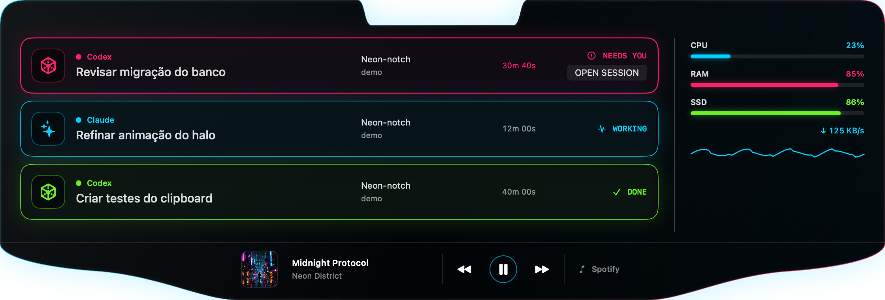

# Neon Notch

[](https://github.com/T0minh0/Neon-notch/actions/workflows/ci.yml)
[](LICENSE)


Neon Notch is a native SwiftUI utility that turns a MacBook notch into a private, local control surface for coding agents, Spotify, system metrics, and recent clipboard items.

> **Early alpha:** Neon Notch is actively evolving. Expect rough edges, changing integration behavior, and no compatibility guarantee between pre-release versions.



## Highlights

- Follow recent Codex and Claude Code activity, including attention-needed states.
- Install a small local helper and merge hooks through the app's onboarding or Settings.
- Control Spotify, review metrics, and keep a short, local clipboard history from one panel.
- Use the default global shortcut, `Control + Option + Space`, or set your own.
- Keep data on your Mac: no analytics, remote telemetry, or account is required.

## Requirements

- macOS 26 or later
- Xcode 26.6 or later with Swift 6.3 support
- A MacBook with a notch for the intended presentation (the app can still build without one)

## Build from source

The supported Debug workflow builds the app and its `NeonNotchHook` helper without signing your personal installation:

```bash
./script/build_and_run.sh
```

The generated bundle is at `DerivedData/Build/Products/Debug/Neon Notch.app`. To build only, pass `--build-only`.

For a signed personal Release install, first create the local signing identity and then run the installer:

```bash
./script/setup_local_signing.sh
./script/build_and_install.sh
```

The Release script installs to `~/Applications`, signs the helper before the app, verifies the bundle, and keeps the previous app bundle for recovery. It intentionally does not use ad-hoc signing. See the [installation guide](docs/installation.md) before running it.

## Onboarding and permissions

On first launch, complete or defer the in-app onboarding. It checks the Release install location, installs the local helper, configures Codex and Claude Code, requests notifications, tests Spotify and Terminal Automation, and can enable launch at login.

Codex requires an explicit trust decision: after configuring its hook, run `/hooks` in Codex, inspect `NeonNotchHook`, and confirm trust yourself. The app never automates that approval. Claude Code hooks take effect in a new session after configuration.

Notifications and Automation are optional. If macOS denies either, use the recovery actions in Settings or the [troubleshooting guide](docs/troubleshooting.md).

## Privacy and limitations

Neon Notch stores its working data locally in Application Support. The helper records only sanitized event metadata; prompts, responses, commands, and tool arguments are not logged. Clipboard collection skips concealed and transient types and defaults to excluding common password-manager apps. Spotify artwork is cached locally.

The app is not sandboxed by design because it integrates with local tools and Automation. It is not a security boundary, does not sync data, and does not guarantee that external Codex, Claude Code, Spotify, or macOS APIs will remain compatible. Read [privacy and security](docs/privacy-security.md) for details.

## Project guide

- [Installation](docs/installation.md)
- [Architecture](docs/architecture.md)
- [Privacy and security](docs/privacy-security.md)
- [Troubleshooting](docs/troubleshooting.md)
- [Design QA](docs/design-qa.md)
- [Contributing](CONTRIBUTING.md)
- [Support](SUPPORT.md)
- [Security policy](SECURITY.md)
- [Changelog](CHANGELOG.md)
- [License](LICENSE)

## Testing

Run the canonical macOS test suite from the repository root:

```bash
xcodebuild \
  -project NeonNotch.xcodeproj \
  -scheme NeonNotch \
  -configuration Debug \
  -derivedDataPath DerivedData \
  -destination 'platform=macOS,arch=arm64' \
  CODE_SIGNING_ALLOWED=NO \
  test
```
